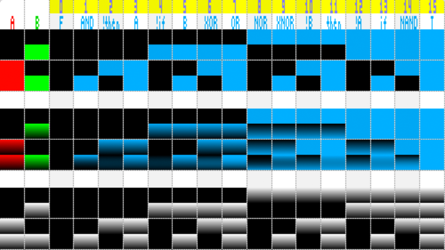
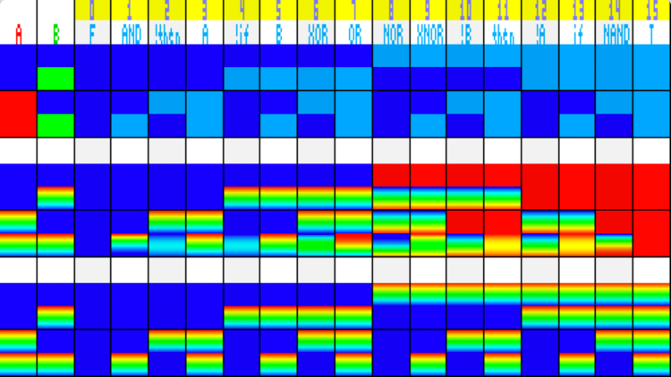

# Boolean Floating-point Truth Table

# Demo

Boolean Floating-Point Truth Table
* https://www.shadertoy.com/view/lsXyDH

# Pictures





# Explanation

Boolean Logic or Truth Tables are tradionally defined as integer only.
* https://en.wikipedia.org/wiki/Truth_table#Binary_operations


| P | Q | F |AND|!thn| p |!if| q |XOR|OR |NOR|XNOR|!q |then|!p |if |NAND| T |
|:-:|:-:|:-:|:-:|:--:|:-:|:-:|:-:|:-:|:-:|:-:|:--:|:-:|:--:|:-:|:-:|:--:|:-:|
| 0 | 0 | 0 | 0 | 0  | 0 | 0 | 0 | 0 | 0 | 1 | 1  | 1 | 1  | 1 | 1 | 1  | 1 |
| 0 | 1 | 0 | 0 | 0  | 0 | 1 | 1 | 1 | 1 | 0 | 0  | 0 | 0  | 1 | 1 | 1  | 1 |
| 1 | 0 | 0 | 0 | 1  | 1 | 0 | 0 | 1 | 1 | 0 | 0  | 1 | 1  | 0 | 0 | 1  | 1 |
| 1 | 1 | 0 | 1 | 0  | 1 | 0 | 1 | 0 | 1 | 0 | 1  | 0 | 1  | 0 | 1 | 0  | 1 |
|Wik| - |#0 |#8 |#4  |#12|#2 |#10|#6 |#14|#1 |#9  |#5 |##13|#3 |#11|#7  |#15|
| - | - |#0 |#1 |#2  |#3 |#4 |#5 |#6 |#7 |#8 |#9  |#10|#11 |#12|#13|#14 |#15|

The bottom two rows are the enumeration of the 16 possible outcomes.
Wikipedia reveres the order of P and Q because it was written by a philosophy.
In Mathematics and Computer Science we count, in Binary, up from 00, 01, 10, 11.

However, we _can_ extend this to floating-poing math! Here are the formulas:

| # |Name | Operation             |
|:-:|:---:|:---------------------:|
| 0 |False| 0                     |
| 1 | AND | p*q                   |
| 2 |!then| p*(1-q)               |
| 3 |  p  | p                     |
| 4 |!if  | (1-p)*q               |
| 5 |  q  | q                     |
| 6 | XOR | p\*(1-q)+(1-p)\*q     |
| 7 | OR  | 1-(1-q)*(1-p)         |
| 8 | NOR |   (1-q)*(1-p)         |
| 9 |XNOR | 1-(p\*(1-q)+(1-p)\*q) |
|10 | !q  | 1-q                   |
|11 |then | 1-(1-p)*q             |
|12 | !p  | 1-p                   |
|13 | if  | 1-p*(1-q)             |
|14 |NAND | 1-p*q                 |
|15 |True | 1                     |


Note(s):

```
    Entries 8 .. 15 are `1 - x` of #0..#7, except for `if`, `then`, `!if`, and `then`

    XOR can be thought as:

        !then + !if

    OR can be simplified:

        = 1-(1-q)*(1-p)
        = 1 - [(1-q)*(1-p)]
        = 1 - (1 - p -q + pq)
        = 1 + -1 + p + q - pq
        = p + q - pq
        = p + q*(1-p)

    XNOR can be simplified:

        = 1-(p*(1-q)+(1-p)*q)
        = 1 - [p*(1-q) + (1-p)*q]
        = 1 - (p-p*q + q-p*q)
        = 1 + -p + p*q -q + p*q
        = 1 - p - q + 2*p*q
```

Legend:

```
    ! means logical NOT, whereas `N` means `1.0 - x`.
    i.e. OR = (1-q)*(1-p), NOR = 1 - OR(p,q)
```

# Problem

Sometimes you will seen this alternative definition for XOR:

```c
    mod( p + q, 2 )
```

Which turns into this function:
```c
    float bXOR2( float a, float b ) { return mod(a+b,2.0); }
```

Which produces this output:

    0 0  0+0=0
    0 1  0+1=1
    1 0  1+0=1
    1 1  0+0=0

This is valid for integers but is MUDDY for floating-point.
Why does this alternate defintion of XOR fail?

    XOR2( 0.5, 0.5 ) returns 0.5 instead of correct 0.0


Likewise NAND, 1-a-b, completely FAILS for these values:

| p   | q   | Incorrect | Correct |
|:---:|:----|:---------:|:-------:|
| 0.0 | 0.0 | 1-0*0 = 1 | 0.0     | 
| 0.5 | 0.5 | 1-0.5*0.5 = 0.25 | 0.5 |


# Solution

To "cleanup" the residiual values we need to do two things:

* use ceil(a), and ceil(b) for the initial boolean result
* scale the result by the gradient

For NAND this means:

| p   | q   | ceil(p) | ceil(q) | 1-ceil(p)*ceil(q) | (1-p*q)*gradient |
|:---:|:----|:-------:|:-------:|------------------:|:----------------:|
| 0.0 | 0.0 | 0.0     | 0.0     | 1 - 0*0 = 1       | 1*0.0 = 0.0      | 
| 0.0 | 0.5 | 0.0     | 1.0     | 1 - 0*1 = 1       | 1*0.5 = 0.5      |
| 0.5 | 0.0 | 1.0     | 0.0     | 1 - 1*0 = 1       | 1*0.5 = 0.5      |
| 0.5 | 0.5 | 1.0     | 1.0     | 1 - 1*1 = 0       | 0*0.5 = 0.0      |

